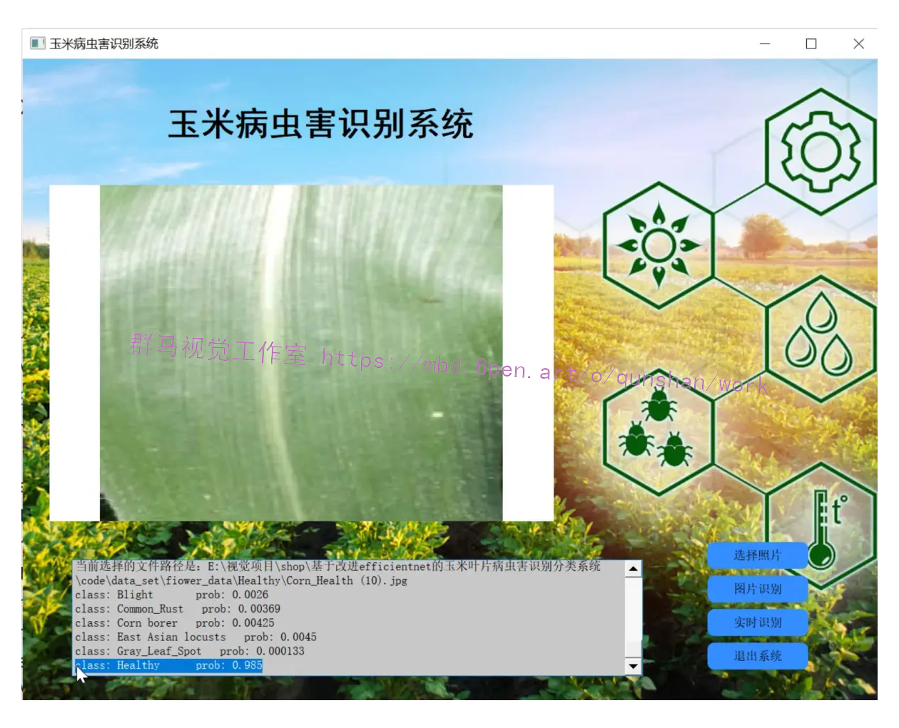
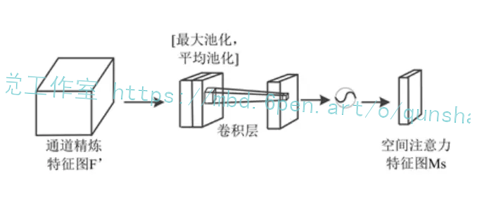

# 1.研究背景与意义


农作物病虫害是农业生产中的重要问题之一，它们对农作物的生长和产量造成了严重的影响。在农业生产中，玉米是一种重要的粮食作物，然而，玉米叶片病虫害的识别和分类一直是一个具有挑战性的问题。传统的方法通常依赖于人工观察和经验判断，这种方法不仅费时费力，而且容易出现误判，影响农作物的健康和产量。

近年来，随着深度学习技术的快速发展，基于图像识别的病虫害分类系统成为了研究的热点。然而，由于玉米叶片病虫害的多样性和复杂性，现有的方法在准确性和鲁棒性方面仍然存在一定的局限性。因此，开发一种高效准确的玉米叶片病虫害识别分类系统具有重要的理论和实际意义。

在这个背景下，本研究旨在基于改进的EfficientNet模型，设计和开发一种玉米叶片病虫害识别分类系统。EfficientNet是一种高效的卷积神经网络模型，它在图像分类任务中表现出色，并且具有较低的计算复杂度。通过对EfficientNet模型进行改进和优化，我们希望能够提高玉米叶片病虫害识别分类系统的准确性和鲁棒性。

本研究的意义主要体现在以下几个方面：

1. 提高农作物病虫害的识别和分类准确性：通过引入改进的EfficientNet模型，我们可以利用其强大的图像分类能力来提高玉米叶片病虫害的识别和分类准确性。这将有助于及时发现和控制病虫害，减少农作物的损失。

2. 降低人工观察和判断的成本和误差：传统的病虫害识别和分类方法通常依赖于人工观察和经验判断，这不仅费时费力，而且容易出现误判。通过引入自动化的图像识别系统，可以降低人工观察和判断的成本和误差，提高工作效率。

3. 推动农业智能化发展：随着信息技术的不断进步，农业智能化已经成为农业发展的重要方向。开发基于改进EfficientNet的玉米叶片病虫害识别分类系统，将为农业智能化发展提供有力支持，促进农业生产的现代化和可持续发展。

总之，基于改进EfficientNet的玉米叶片病虫害识别分类系统的研究具有重要的理论和实际意义。它不仅可以提高农作物病虫害的识别和分类准确性，降低人工观察和判断的成本和误差，还可以推动农业智能化发展，促进农业生产的现代化和可持续发展。

# 2.图片演示



# 3.视频演示
[基于改进efficientnet的玉米叶片病虫害识别分类系统_哔哩哔哩_bilibili](https://www.bilibili.com/video/BV1ij411e76U/?spm_id_from=333.999.0.0&vd_source=ff015de2d29cbe2a9cdbfa7064407a08)

# 4.EfficientNet简介
EfficientNet 的诞生是基于对现有图像分类网络的不足和挑战性任务的需求。传统的图像分类网络，如 AlexNet、VGG、ResNet 和 Inception，虽然在一些任务上表现出色，但它们往往需要大量的计算资源和参数数量，这使得它们不适用于嵌入式设备或移动端应用。此外，设计和调整这些网络的架构需要大量的经验和时间。

为了解决这些问题，研究人员提出了一种新的思路，即通过缩放网络的深度、宽度和分辨率参数来构建高效的图像分类网络。这个思路的灵感来自于一个观察：深度、宽度和分辨率是影响网络性能的三个关键因素。通过合理地缩放这些参数，可以在保持高性能的同时减少计算成本和参数数量。

#### EfficientNet 的原理
EfficientNet 的核心原理可以总结为缩放的深度、宽度和分辨率。具体来说，它包括以下三个关键组件：

深度缩放（Depth Scaling）：深度缩放是指增加网络的层数，以提高模型的表示能力。然而，过度增加网络深度会导致过拟合和计算成本的增加。因此，EfficientNet 使用了一个复合系数（compound coefficient）来平衡深度和计算成本。这个复合系数通过简单的线性关系来确定网络的深度，例如：d = α * φ，其中 d 是深度，α 是复合系数，φ 是基准深度。这个复合系数通过在一组预定义的 α 值中进行搜索来确定，从而使得网络在性能和计算成本之间取得平衡。

宽度缩放（Width Scaling）：宽度缩放是指增加每层的通道数（即卷积核的数量），以提高网络的特征提取能力。EfficientNet 使用了一个复合系数来决定每层的通道数，类似于深度缩放。这个复合系数通过线性关系来计算，例如：w = β * ψ，其中 w 是通道数，β 是复合系数，ψ 是基准通道数。复合系数 β 也是在一组预定义的值中搜索得到的。

分辨率缩放（Resolution Scaling）：分辨率缩放是指改变输入图像的分辨率，以适应不同的任务和计算资源。EfficientNet 使用一个复合系数来确定输入图像的分辨率，类似于深度和宽度缩放。这个复合系数通过线性关系来计算，例如：r = γ * ω，其中 r 是输入分辨率，γ 是复合系数，ω 是基准分辨率。复合系数 γ 也是在一组预定义的值中搜索得到的。

综合考虑这三个缩放因素，EfficientNet 的整体架构可以根据复合系数 α、β 和 γ 来确定。这种缩放策略使得 EfficientNet 可以在不同的任务和计算资源下实现高效的性能。

#### EfficientNet 的架构
EfficientNet 的整体架构是基于深度可分离卷积（Depthwise Separable Convolution）的卷积块构建的。深度可分离卷积是一种轻量级的卷积操作，它将标准卷积分成两个步骤：深度卷积和逐点卷积。这种操作减少了计算量，同时保持了特征表示的质量。

EfficientNet 通过堆叠深度可分离卷积块来构建网络的主体结构。网络的深度和宽度根据之前提到的复合系数 α 和 β 进行缩放，以适应不同的任务和资源限制。此外，EfficientNet 还包括了一些额外的技巧，如扩展卷积（Expansion Convolution）和逆残差连接（Inverse Residual Connection），以进一步提高性能和效率。

#### EfficientNet 的应用领域
EfficientNet 在图像分类任务中取得了显著的成果，但它不仅局限于此。由于其高效的性能和轻量级的架构，EfficientNet 在许多计算机视觉领域都有广泛的应用：

目标检测（Object Detection）：EfficientNet 可以作为目标检测模型的基础，用于检测图像中的物体。它的高效性能使得目标检测在嵌入式设备和移动端应用中变得更加可行。

语义分割（Semantic Segmentation）：EfficientNet 可以用于像素级的图像分割任务，将图像中的每个像素分配到不同的类别。其高效的特征提取能力有助于提高分割的准确性。

人脸识别（Face Recognition）：EfficientNet 可以用于人脸识别任务，识别和验证个体的身份。在移动设备上进行实时人脸识别时，EfficientNet 的高效性能尤为重要。

自然语言处理（Natural Language Processing）：虽然 EfficientNet 主要是为图像处理任务设计的，但其缩放原理可以启发自然语言处理领域的模型设计，如文本分类和情感分析。

#### 为什么选择 EfficientNet-B0 作为特征提取器
在众多的 EfficientNet 版本中，为什么选择 EfficientNet-B0 作为特征提取器的原因主要有以下几点：

轻量级架构：EfficientNet-B0 是所有 EfficientNet 版本中最轻量级的一个。它具有相对较低的参数数量和计算成本，适合在资源有限的环境中运行。

广泛应用性：虽然 EfficientNet-B0 在参数数量和计算成本上较低，但在许多图像分类任务中仍然表现出色。因此，它可以作为一个通用的特征提取器，适用于多种应用领域。

快速迭代和实验：由于其相对较小的规模，EfficientNet-B0 的训练和微调速度较快，这使得研究人员可以更快地进行实验和迭代，以找到最佳的模型配置。

总之，EfficientNet 是一个高效的图像分类网络，通过合理地缩放深度、宽度和分辨率参数，实现了高性能和低计算成本的平衡。在众多的 EfficientNet 版本中，选择 EfficientNet-B0 作为特征提取器的原因在于其轻量级的架构和广泛的应用性，使其成为许多计算机视觉任务的理想选择。希望随着时间的推移，EfficientNet 可能会继续演进，为图像处理和计算机视觉领域带来更多的创新和突破。

# 5.核心代码讲解

#### 5.1 fit.py

```python

# MBConv模块
class MBConv(nn.Module):
    def __init__(self, in_channels, out_channels, kernel_size, stride=1, expansion_factor=6, reduction_ratio=4):
        super(MBConv, self).__init__()

        # 升维
        self.expand = nn.Conv2d(in_channels, in_channels * expansion_factor, kernel_size=1, stride=1, padding=0)
        self.bn_expand = nn.BatchNorm2d(in_channels * expansion_factor)
        self.relu = nn.ReLU(inplace=True)

        # 深度可分离卷积
        self.depthwise = nn.Conv2d(in_channels * expansion_factor, in_channels * expansion_factor,
                                   kernel_size=kernel_size, stride=stride, padding=kernel_size // 2,
                                   groups=in_channels * expansion_factor)
        self.bn_depthwise = nn.BatchNorm2d(in_channels * expansion_factor)

        # SE模块
        self.global_avgpool = nn.AdaptiveAvgPool2d(1)
        self.fc1 = nn.Linear(in_channels * expansion_factor, in_channels * expansion_factor // reduction_ratio)
        self.fc2 = nn.Linear(in_channels * expansion_factor // reduction_ratio, in_channels * expansion_factor)

        # 降维
        self.project = nn.Conv2d(in_channels * expansion_factor, out_channels, kernel_size=1, stride=1, padding=0)
        self.bn_project = nn.BatchNorm2d(out_channels)

    def forward(self, x):
        identity = x
        # 升维
        x = self.expand(x)
        x = self.bn_expand(x)
        x = self.relu(x)

        # 深度可分离卷积
        x = self.depthwise(x)
        x = self.bn_depthwise(x)
        x = self.relu(x)

        # Squeeze Excitation
        b, c, _, _ = x.size()
        se = self.global_avgpool(x).view(b, c)
        se = F.relu(self.fc1(se), inplace=True)
        se = self.fc2(se).sigmoid().view(b, c, 1, 1)
        x = x * se

        # 降维
        x = self.project(x)
        x = self.bn_project(x)

        # 残差连接
        if identity.size() == x.size():
            x += identity
        return x


# CAM模块
class CAM(nn.Module):
    def __init__(self, in_channels, reduction_ratio=16):
        super(CAM, self).__init__()

        # 全局平均池化和全局最大池化
        self.global_avgpool = nn.AdaptiveAvgPool2d(1)
        self.global_maxpool = nn.AdaptiveMaxPool2d(1)

        # 共享多层感知机
        self.fc1 = nn.Linear(in_channels, in_channels // reduction_ratio)
        self.fc2 = nn.Linear(in_channels // reduction_ratio, in_channels)

    def forward(self, x):
        b, c, _, _ = x.size()
        # 平均池化和最大池化得到的特征
        avg_feats = self.global_avgpool(x).view(b, c)
        max_feats = self.global_maxpool(x).view(b, c)

        # 通过共享MLP
        avg_feats = self.fc2(F.relu(self.fc1(avg_feats)))
        max_feats = self.fc2(F.relu(self.fc1(max_feats)))

        # 逐元素的加和操作
        combined = avg_feats + max_feats
        weights = combined.sigmoid().view(b, c, 1, 1)

        return x * weights


# SAM模块
class SAM(nn.Module):
    def __init__(self):
        super(SAM, self).__init__()
        # 空间注意力机制
        self.conv = nn.Conv2d(2, 1, kernel_size=7, padding=3, stride=1)

    def forward(self, x):
        avg_feats = torch.mean(x, dim=1, keepdim=True)
        max_feats, _ = torch.max(x, dim=1, keepdim=True)
        x = torch.cat([avg_feats, max_feats], dim=1)
        x = self.conv(x).sigmoid()
        return x
......
```

fit.py是一个包含了MBConv、CAM、SAM和CBAM模块的程序文件。

MBConv模块是一个包含了升维、深度可分离卷积、SE模块和降维的模块。其中，升维部分使用了1x1卷积和批归一化操作，深度可分离卷积部分使用了指定大小的卷积核和组卷积操作，SE模块使用了全局平均池化、全连接层和sigmoid激活函数，降维部分使用了1x1卷积和批归一化操作。

CAM模块是一个包含了全局平均池化、全局最大池化和共享多层感知机的模块。其中，全局平均池化和全局最大池化得到了平均池化和最大池化的特征，通过共享多层感知机进行处理，然后通过逐元素的加和操作得到权重。

SAM模块是一个包含了空间注意力机制的模块。其中，通过求平均值和最大值得到了平均特征和最大特征，然后将它们拼接在一起，通过一个卷积层得到注意力权重。

CBAM模块是一个包含了CAM和SAM模块的模块。其中，通过CAM模块得到通道注意力权重，通过SAM模块得到空间注意力权重，然后将它们相乘得到最终的注意力权重。

这些模块可以用于构建卷积神经网络，用于图像分类、目标检测等任务。

#### 5.2 my_dataset.py

封装为类后的代码如下：

```python

class MyDataSet(Dataset):
    """自定义数据集"""

    def __init__(self, images_path: list, images_class: list, transform=None):
        self.images_path = images_path
        self.images_class = images_class
        self.transform = transform

    def __len__(self):
        return len(self.images_path)

    def __getitem__(self, item):
        img = Image.open(self.images_path[item])
        label = self.images_class[item]

        if self.transform is not None:
            img = self.transform(img)

        return img, label

    @staticmethod
    def collate_fn(batch):
        images, labels = tuple(zip(*batch))

        images = torch.stack(images, dim=0)
        labels = torch.as_tensor(labels)
        return images, labels
```

这个程序文件名为my_dataset.py，它定义了一个名为MyDataSet的自定义数据集类。这个类继承自torch.utils.data.Dataset类，用于加载和处理数据集。

这个类的构造函数接受两个参数：images_path和images_class，分别表示图像文件路径和对应的类别标签。还有一个可选参数transform，用于对图像进行预处理。

这个类实现了两个必要的方法：__len__和__getitem__。__len__方法返回数据集的大小，即图像文件路径的数量。__getitem__方法根据给定的索引item，打开对应的图像文件，检查图像的模式是否为RGB，然后返回图像和对应的标签。

这个类还定义了一个静态方法collate_fn，用于对一个batch的数据进行处理。它将输入的batch中的图像和标签分别提取出来，并将图像堆叠成一个张量，标签转换为张量。最后返回处理后的图像和标签。

这个程序文件依赖于PIL库和torch库，使用时需要先导入这两个库。


#### 5.3 trans_weights_to_pytorch.py

```python

class EfficientNetConverter:
    def __init__(self, save_path):
        self.save_path = save_path

    def convert(self):
        m = tf.keras.applications.EfficientNetB0()
        weights_dict = dict()
        weights = m.weights[3:]  # delete norm weights
        for weight in weights:
            name = weight.name
            data = weight.numpy()

            if "stem_conv/kernel:0" == name:
                torch_name = "features.stem_conv.0.weight"
                weights_dict[torch_name] = np.transpose(data, (3, 2, 0, 1)).astype(np.float32)
            elif "stem_bn/gamma:0" == name:
                torch_name = "features.stem_conv.1.weight"
                weights_dict[torch_name] = data
            elif "stem_bn/beta:0" == name:
                torch_name = "features.stem_conv.1.bias"
                weights_dict[torch_name] = data
            elif "stem_bn/moving_mean:0" == name:
                torch_name = "features.stem_conv.1.running_mean"
                weights_dict[torch_name] = data
            elif "stem_bn/moving_variance:0" == name:
                torch_name = "features.stem_conv.1.running_var"
                weights_dict[torch_name] = data
            elif "block" in name:
                name = name[5:]  # delete "block" word
                block_index = name[:2]  # 1a, 2a, ...
                name = name[3:]  # delete block_index and "_"
                torch_prefix = "features.{}.block.".format(block_index)

                trans_dict = {"expand_conv/kernel:0": "expand_conv.0.weight",
                              "expand_bn/gamma:0": "expand_conv.1.weight",
                              "expand_bn/beta:0": "expand_conv.1.bias",
                              "expand_bn/moving_mean:0": "expand_conv.1.running_mean",
                              "expand_bn/moving_variance:0": "expand_conv.1.running_var",
                              "dwconv/depthwise_kernel:0": "dwconv.0.weight",
                              "bn/gamma:0": "dwconv.1.weight",
                              "bn/beta:0": "dwconv.1.bias",
                              "bn/moving_mean:0": "dwconv.1.running_mean",
                              "bn/moving_variance:0": "dwconv.1.running_var",
                              "se_reduce/kernel:0": "se.fc1.weight",
                              "se_reduce/bias:0": "se.fc1.bias",
                              "se_expand/kernel:0": "se.fc2.weight",
                              "se_expand/bias:0": "se.fc2.bias",
                              "project_conv/kernel:0": "project_conv.0.weight",
                              "project_bn/gamma:0": "project_conv.1.weight",
                              "project_bn/beta:0": "project_conv.1.bias",
                              "project_bn/moving_mean:0": "project_conv.1.running_mean",
                              "project_bn/moving_variance:0": "project_conv.1.running_var"}

                assert name in trans_dict, "key '{}' not in trans_dict".format(name)
                torch_postfix = trans_dict[name]
                torch_name = torch_prefix + torch_postfix
                if torch_postfix in ["expand_conv.0.weight", "se.fc1.weight", "se.fc2.weight", "project_conv.0.weight"]:
                    data = np.transpose(data, (3, 2, 0, 1)).astype(np.float32)
                elif torch_postfix == "dwconv.0.weight":
                    data = np.transpose(data, (2, 3, 0, 1)).astype(np.float32)
                weights_dict[torch_name] = data
            elif "top_conv/kernel:0" == name:
                torch_name = "features.top.0.weight"
                weights_dict[torch_name] = np.transpose(data, (3, 2, 0, 1)).astype(np.float32)
            elif "top_bn/gamma:0" == name:
                torch_name = "features.top.1.weight"
                weights_dict[torch_name] = data
            elif "top_bn/beta:0" == name:
                torch_name = "features.top.1.bias"
                weights_dict[torch_name] = data
            elif "top_bn/moving_mean:0" == name:
                torch_name = "features.top.1.running_mean"
                weights_dict[torch_name] = data
            elif "top_bn/moving_variance:0" == name:
                torch_name = "features.top.1.running_var"
                weights_dict[torch_name] = data
            elif "predictions/kernel:0" == name:
                torch_name = "classifier.1.weight"
                weights_dict[torch_name] = np.transpose(data, (1, 0)).astype(np.float32)
            elif "predictions/bias:0" == name:
                torch_name = "classifier.1.bias"
                weights_dict[torch_name] = data
            else:
                raise KeyError("no match key '{}'".format(name))

        for k, v in weights_dict.items():
            weights_dict[k] = torch.as_tensor(v)

        torch.save(weights_dict, self.save_path)
        print("Conversion complete.")
......
```

这个程序文件是用来将TensorFlow的EfficientNet模型的权重转换为PyTorch模型的权重。程序首先创建了一个EfficientNetB0模型，并下载了权重。然后，程序遍历模型的所有权重，并根据权重的名称将其转换为PyTorch模型中对应的权重名称。转换过程中，程序还对权重的维度进行了调整，以适应PyTorch模型的要求。最后，程序将转换后的权重保存为.pth文件。


## 6.系统整体结构

整体功能和构架概括：
该项目是一个基于改进EfficientNet的玉米叶片病虫害识别分类系统。它包含了多个程序文件，每个文件负责不同的功能。其中，fit.py定义了包含MBConv、CAM、SAM和CBAM模块的卷积神经网络模型；model.py定义了EfficientNet模型的构建和各个模块的实现；my_dataset.py定义了自定义数据集类，用于加载和处理数据集；predict.py用于使用训练好的模型对图像进行分类预测；train.py是一个训练脚本，用于训练模型；trans_weights_to_pytorch.py用于将TensorFlow的EfficientNet模型权重转换为PyTorch模型权重；ui.py是一个使用PyQt5编写的玉米病虫害识别系统的图形界面；utils.py包含了一些辅助函数。

下面是每个文件的功能整理：

| 文件名                           | 功能                                                         |
| -------------------------------- | ------------------------------------------------------------ |
| fit.py                           | 定义了包含MBConv、CAM、SAM和CBAM模块的卷积神经网络模型       |
| model.py                         | 定义了EfficientNet模型的构建和各个模块的实现                   |
| my_dataset.py                    | 定义了自定义数据集类，用于加载和处理数据集                     |
| predict.py                       | 使用训练好的模型对图像进行分类预测                           |
| train.py                         | 训练脚本，用于训练模型                                       |
| trans_weights_to_pytorch.py       | 将TensorFlow的EfficientNet模型权重转换为PyTorch模型权重       |
| ui.py                            | 使用PyQt5编写的玉米病虫害识别系统的图形界面                   |
| utils.py                         | 包含了一些辅助函数                                           |

以上是对每个文件功能的简要概述。

# 7.改进efficientnet
#### MBConv
MBConv是由Google Brain团队的研究人员在论文中提出的。如图所示，MBConv模块由左右两个部分组成，左边是该模块的主干部分，右边是该模块的残差边。首先对输入特征层进行卷积核大小为1 × 1的卷积操作以实现升维，然后进行标准化和激活函数。接着进行卷积核大小为3 × 3或5 × 5的深度可分离卷积，之后进行标准化和激活函数。再进行添加注意力机制，注意力机制部分也包括两个部分，左边是SE (Squeeze Excitation)注意力模块，右边是需要添加注意力的特征层。在SE模块中，首先对输入特征层进行全局平均池化，然后利用缩减比对神经元数量进行缩减，其宽度或神经元数量由缩减比决定。缩减比越高，瓶颈中的神经元数量越少，反之亦然。接着进行1 × 1卷积降维和1 × 1卷积升维，此时获得的特征层通道数和输入特征层通道数相等，可以代表注意力机制输入的特征层每个通道的权重，最后进行相乘操作实现了注意力机制的施加。最后通过一个卷积核大小为1 × 1的卷积进行降维操作，标准化操作后增加残差边得到最后的输出特征层。


EfficientNet由1个Stem、16个MBConv模块、Con2D、GlobalAveragePooling2D和Dense组成。Stem用于进行特征的初步提取，由卷积、标准化和激活函数构成。该网络的核心是16个MBConv模块。MBConv模块是EfficientNet特有的特征提取结构，在模块堆叠的过程中完成高效的特征提取。Conv2D + GlobalAveragePooling2D + Dense是该网络的分类头，全连接后用于最终的分类。


#### 融合CBAM模块
CBAM (Convolutional Block Attention Module)是一种新的卷积注意力模块，论文《A Wear Type Recognition Algorithm for Ferrography Images Based on CBAM-EfficientNet-B0》创新地提出了通道注意力模块(Channel Attention Module, CAM)与空间注意力模块(Spatial Attention Module, SAM)融合的注意力机制。该注意力模块对于前馈卷积神经网络来说简单又有效，同时又具有轻量化、通用性强的优点，可以无缝集成到任何卷积神经网络中以从中间的“输入特征图”中获得后续的“精炼特征图”，从而提高网络的分类精度的效果。CBAM的结构如图所示。


CAM的网络结构图如图所示。CAM较SE做了修改，不是通过全局平均池化将特征进行下采样，而是将输入特征图分解为2个后续的维度向量，其中一个向量由全局平均池化层生成，另一个向量由全局最大池化层生成。全局平均池化层主要用于聚合空间信息，而全局最大池化层以图像中对象边缘的形式保留了更丰富的上下文信息，从而得到更精细的通道注意力。简而言之，平均池化具有平滑效果，而最大池化具有更锐利的效果，但更精确地保留了对象的自然边缘。研究表明，使用全局平均池化层和最大池化比仅使用平均池化得到的结果更好。然后分别经过共享多层感知机(Multilayer Perceptron, MLP)。将MLP输出的特征进行基于逐元素的加和操作，再经过Sigmoid激活操作，生成最终的通道注意力特征图。将该通道注意力特征图和输入特征图做逐元素的乘法操作，生成空间注意力模块需要的输入特征。


SAM的网络结构图如图所示。空间注意模块由三部分组成，第一部分为通道池化层，输入层被分解成两个通道即最大池化和平均池化，然后将这两个通道汇集作为下一层的输入。因此，这个卷积层是一个空间维度保持卷积。第二部分是批量标准化(BatchNorm, BN)层，用于对卷积的输出进行归一化和缩放。第三部分是Sigmiod激活层。Sigmoid是一种概率激活，它将所有值映射到0到1之间的范围内。然后使用简单的元素乘积将这个空间注意掩码应用于输入张量中的所有特征图。


原EfficientNet-B0网络中虽包含通道注意力机制SE，但CBAM中的CAM较SE做了改进，同时原网络未考虑空间信息注意力，而CBAM中包含了这一机制，将CBAM引入到EfficientNet-B0网络可以进一步提升网络的特征提取能力从而使网络的识别精度更高。

如图所示，CBAM-EfficientNet-B0主要由EfficientNet-B0和CBAM模块组成。在CBAM-EfficientNet-B0中，EfficientNet-B0模型用于提取磨粒特征，将CBAM模块插入在16个MBConv模块之后用于将提取到的特征进行细化。当输入磨粒图像的特征图F输入到CBAM模块时，CBAM模块首先将特征图F发送到通道注意力模块进行处理，得到输入磨粒图像的通道注意力特征图Mc。然后，将Mc与F相乘得到空间注意力模块所需的精炼磨粒特征图F’。然后，将F’送入空间注意力模块，生成磨粒图像的空间注意力特征图Ms，Ms乘以F’生成CBAM模块的输出磨粒图像特征图。该模型输入为图像分辨率为224 × 224的三通道图像，识别结果作为输出。


# 8.系统整合
下图[完整源码＆环境部署视频教程＆自定义UI界面](https://s.xiaocichang.com/s/130b6c)


参考博客[《基于改进efficientnet的玉米叶片病虫害识别分类系统》](https://mbd.pub/o/qunshan/work)

# 9.参考文献
---
| [1] | 关浩坚, 贺石中, 李秋秋, 杨智宏, 覃楚东, 何伟楚. 卷积神经网络在装备磨损颗粒识别中的研究综述[J]. 摩擦学学报, 2022, 42(2): 426-445. |
| [2] | Wang, S., Wu, T., Wang, K. and Sarkodie-Gyan, T. (2020) Ferrograph Analysis with Improved Particle Segmentation and Classification Methods. Journal of Computing and Information Science in Engineering, 20, Article ID: 021001.
[https://doi.org/10.1115/1.4045291](https://doi.org/10.1115/1.4045291) |
| [3] | Jardine, K., Lin, D. and Banjevic, D. (2006) A Review on Machinery Diagnostics and Prognostics Implementing Condition-Based Maintenance. Mechanical Systems and Signal Processing, 20, 1483-1510.
[https://doi.org/10.1016/j.ymssp.2005.09.012](https://doi.org/10.1016/j.ymssp.2005.09.012) |
| [4] | Li, Q., Zhao, T., Zhang, L., Sun, W. and Zhao, X. (2017) Ferrography Wear Particles Image Recognition Based on Extreme Learning Machine. Journal of Electrical and Computer Engineering, 2017, Article ID: 3451358.
[https://doi.org/10.1155/2017/3451358](https://doi.org/10.1155/2017/3451358) |
| [5] | Peng, P. and Wang, J. (2019) FECNN: A Promising Model for Wear Particle Recognition. Wear, 432-433, Article ID: 202968
[https://doi.org/10.1016/j.wear.2019.202968](https://doi.org/10.1016/j.wear.2019.202968) |
| [6] | Jia, F., Wei, H., Sun, H., Song, L. and Yu, F. (2022) An Object Detection Network for Wear Debris Recognition in Ferrography Images. Journal of the Brazilian Society of Mechanical Sciences and Engineering, 44, Article No. 67.
[https://doi.org/10.1007/s40430-022-03375-4](https://doi.org/10.1007/s40430-022-03375-4) |
| [7] | 向进. 改进分水岭和灰靶理论在铁谱图像分析中的研究[D]: [硕士学位论文]. 南京: 南京航空航天大学, 2016. |
| [8] | Tan, M. and Le, Q. (2019) Efficientnet: Rethinking Model Scaling for Convolutional Neural Networks. Proceedings of the 36th International Conference on Machine Learning, Vol. 97, Long Beach, 9-15 June 2019, 6105-6114. |
| [9] | Woo, S., Park, J., Lee, J.Y. and Kweon, I.S. (2018) Cbam: Convolutional Block Attention Module. Proceedings of the European Conference on Computer Vision, Munich, 8-14 September 2018, 3-19.
[https://doi.org/10.1007/978-3-030-01234-2_1](https://doi.org/10.1007/978-3-030-01234-2_1) |
| [10] | Lever, J., Krzywinski, M. and Altman, N. (2016) Classification Evaluation: It Is Important to Understand Both What a Classification Metric Expresses and What It Hides. Nature Methods, 13, 603-605.
[https://doi.org/10.1038/nmeth.3945](https://doi.org/10.1038/nmeth.3945) |


---
#### 如果您需要更详细的【源码和环境部署教程】，除了通过【系统整合】小节的链接获取之外，还可以通过邮箱以下途径获取:
#### 1.请先在GitHub上为该项目点赞（Star），编辑一封邮件，附上点赞的截图、项目的中文描述概述（About）以及您的用途需求，发送到我们的邮箱
#### sharecode@yeah.net
#### 2.我们收到邮件后会定期根据邮件的接收顺序将【完整源码和环境部署教程】发送到您的邮箱。
#### 【免责声明】本文来源于用户投稿，如果侵犯任何第三方的合法权益，可通过邮箱联系删除。